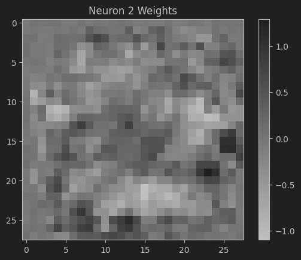
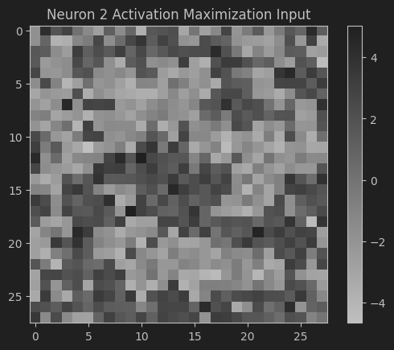

# Neuron/Feature Visualization

## Introduction

In this project, we train a simple neural network on the MNIST dataset and visualize its neurons using two methods:

- **First Hidden Layer Neuron Visualization**
- **Activation Maximization**

By visualizing the neurons, we aim to understand what features the network has learned and how different neurons respond to input patterns.

## Methodology

We employ two techniques:

1. **First Hidden Layer Neuron Visualization**: Visualizing the weights of neurons in the first hidden layer as images.
2. **Activation Maximization**: Generating input images that maximize the activation of a specific neuron using gradient ascent.

## Neural Network Architecture

We use a simple feedforward neural network implemented using Keras with the PyTorch backend. The architecture consists of:

- **Input Layer**: Accepts images of shape `[28, 28, 1]`.
- **Rescaling Layer**: Normalizes pixel values by scaling them by `1/255`.
- **Flatten Layer**: Flattens the input.
- **Dense Layer**: Fully connected layer with `128` units and ReLU activation.
- **Output Layer**: Dense layer with `10` units (one for each class) and softmax activation.

**Hyperparameters:**

- Hidden layer size: `128`
- Batch size: `50`
- Number of epochs: `10`
- Learning rate: `0.01`, decayed exponentially to `0.001`

## Steps

### 1. Training the Neural Network

We train the neural network on the MNIST training data.

### 2. First Hidden Layer Neuron Visualization

Concept: Each neuron in the first hidden layer is connected to every input pixel via weights. By extracting these weights and reshaping them to the input image dimensions, we can visualize which pixels contribute most to the neuron's activation.

Interpretation:

The resulting images show the weight patterns of the neurons. Positive weights (lighter pixels) indicate pixels that positively contribute to the neuron's activation, while negative weights (darker pixels) indicate inhibitory contributions.

### 3. Activation Maximization

Concept: Generate an input image that maximizes the activation of a specific neuron using gradient ascent. This method can be applied to any neuron in the network, not just the first hidden layer.

Interpretation:

The generated image highlights the patterns that strongly activate the selected neuron. This provides insights into what features the neuron is sensitive to.

### 4. Comparing Results

By comparing the weight visualization and the activation maximization image for the same neuron, we observe common patterns.

Both images share common patterns. Areas with positive weights correspond to higher pixel intensities in the activation maximization image, indicating that those pixels contribute significantly to the neuron's activation.

## Project Structure
- [neuron_visualization.ipynb](neuron_visualization.ipynb): Main notebook.
- model.weights.h5: Saved trained model weights.